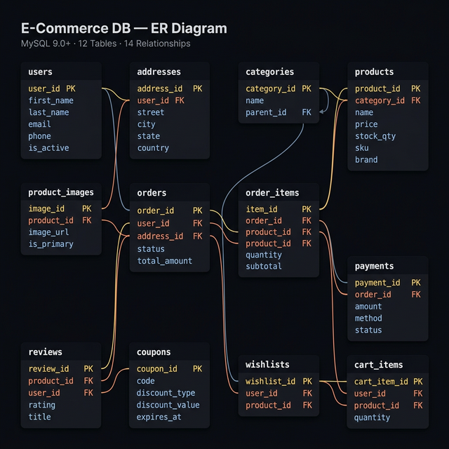
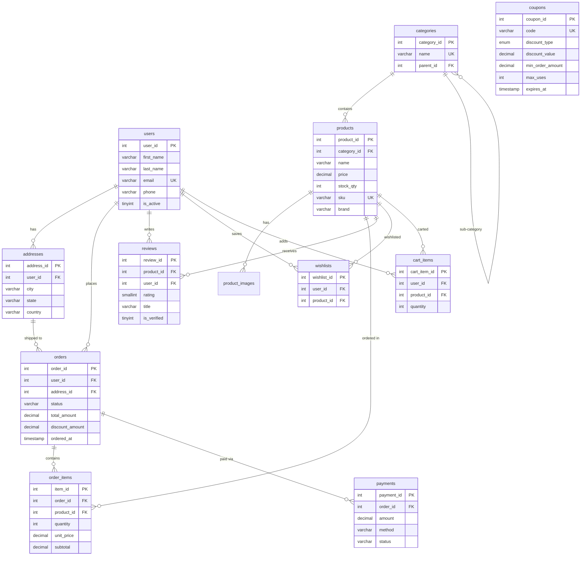
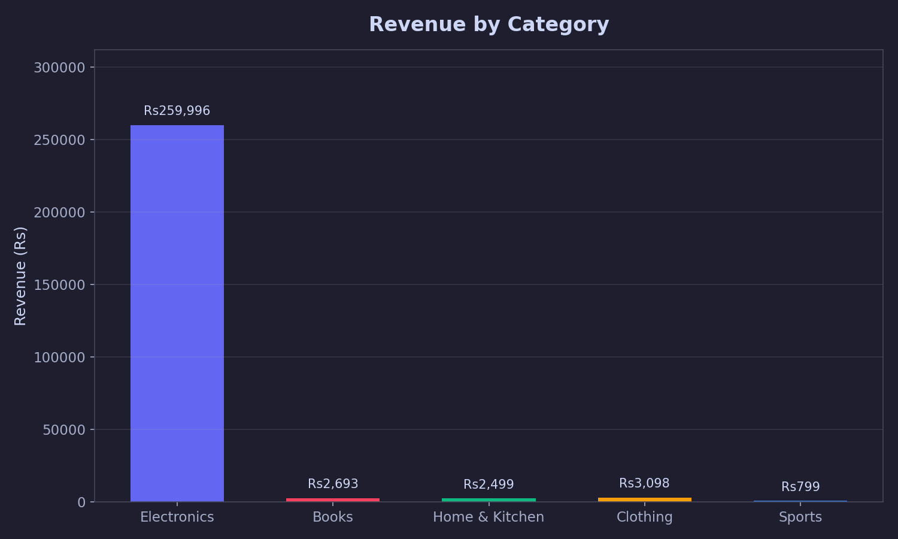
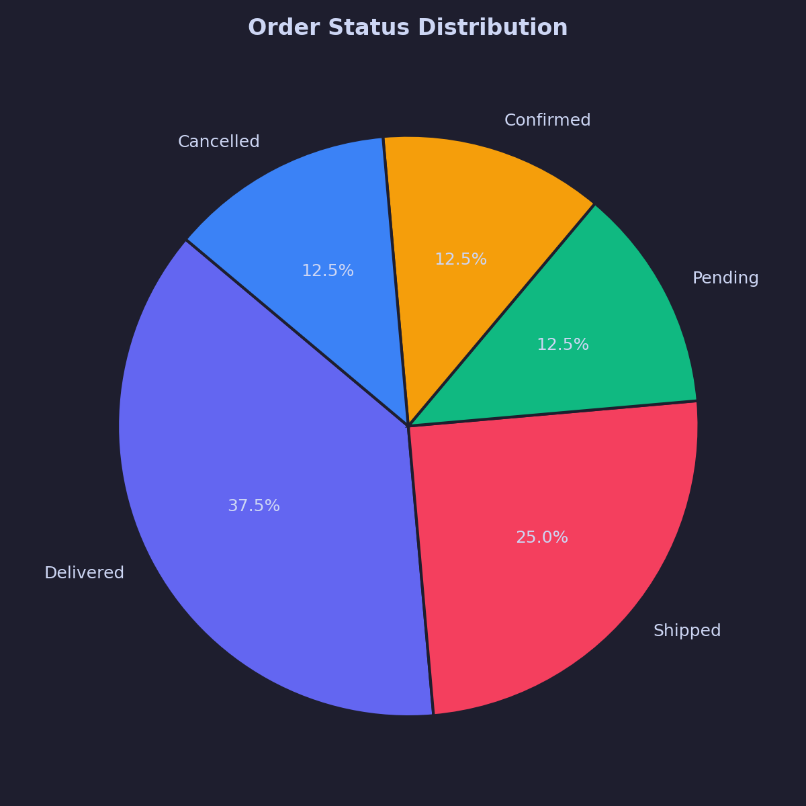
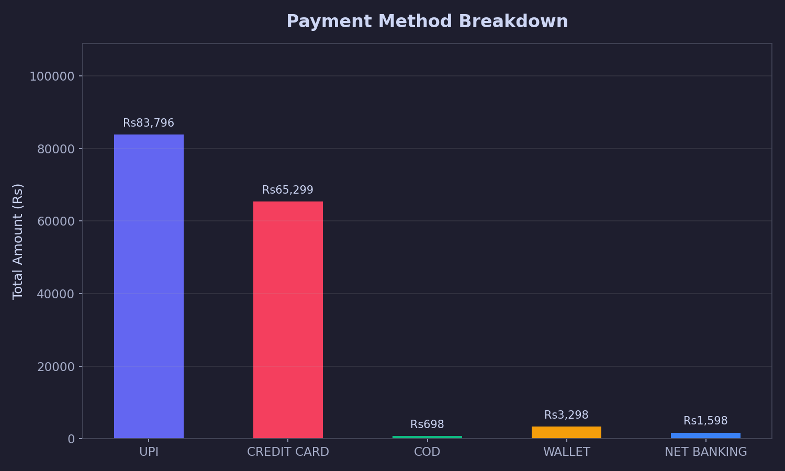
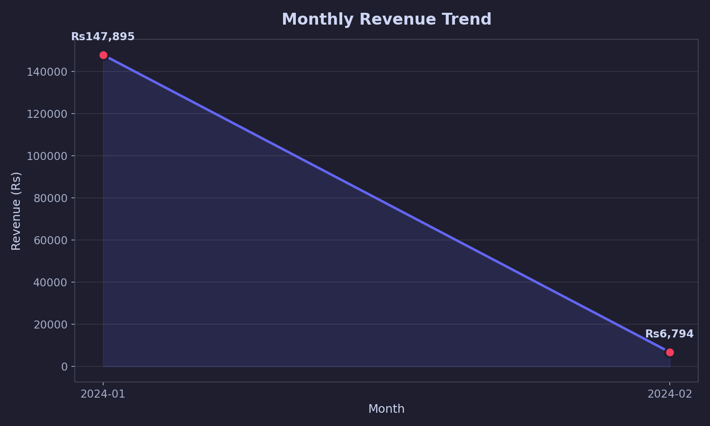
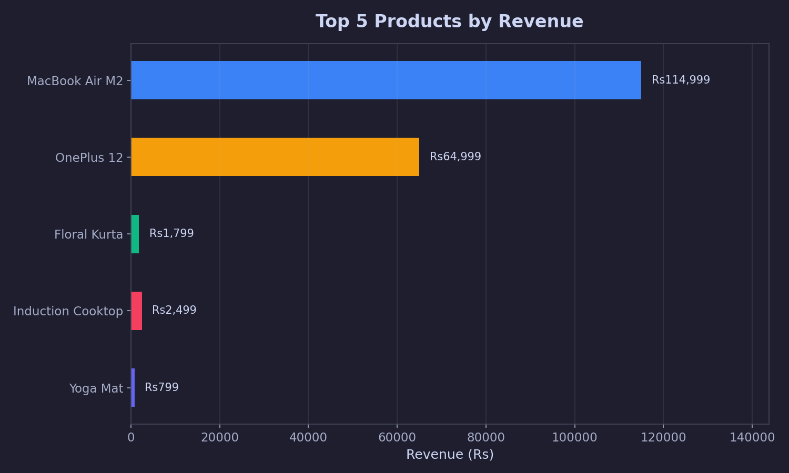

# 🛒 E-Commerce Database — SQL Project


A complete, production-style **relational database design** for an e-commerce platform, built with **MySQL 8.0+**.  
This project demonstrates real-world SQL skills including schema design, normalization, indexing, CTEs, window functions, stored procedures, triggers, and advanced analytics.

---

## 📁 Project Structure

```
ecommerce/
├── schema/
│   ├── 01_schema.sql              # All CREATE TABLE statements + indexes
│   ├── 06_coupons.sql             # Coupon/discount code table + sample data
│   └── 07_wishlist_cart.sql       # Wishlist and cart tables + sample data
├── data/
│   └── 02_seed_data.sql           # Sample data (users, products, orders, etc.)
├── queries/
│   ├── 03_analysis_queries.sql    # Business analysis queries (Q1–Q12)
│   └── 08_advanced_analytics.sql  # Advanced analytics (RFM, Cohorts, Basket)
├── procedures/
│   ├── 04_stored_procedures.sql   # PlaceOrder & CancelOrder workflows
│   └── 09_coupon_functions.sql    # CalculateDiscount & ApplyCoupon
├── triggers/
│   └── 05_triggers.sql            # Auto-update triggers for updated_at
├── visualizations/
│   └── visualize.py               # Python + Matplotlib data visualization
├── .gitignore
├── LICENSE
└── README.md
```

---

## 🗃️ Database Schema

### ER Diagram



<details>
<summary>📐 View Interactive Mermaid Diagram</summary>



</details>

### Tables

| Table | Description |
|---|---|
| `users` | Customer accounts |
| `addresses` | Delivery addresses (multiple per user) |
| `categories` | Product categories with sub-category support |
| `products` | Product catalog with pricing and stock |
| `product_images` | Multiple images per product |
| `orders` | Customer orders with status tracking |
| `order_items` | Line items in each order (computed subtotal) |
| `payments` | Payment records with method and status |
| `reviews` | Product ratings and reviews |
| `coupons` | Discount codes — percent/flat, limits, expiry |
| `wishlists` | User wishlisted products |
| `cart_items` | User shopping cart with quantities |

### Key Design Decisions
- **Normalization**: Schema is in 3NF — no data redundancy
- **Self-referencing categories**: `parent_id` on `categories` supports sub-categories
- **Computed column**: `order_items.subtotal` is auto-calculated via `GENERATED ALWAYS AS`
- **Soft deletes**: `is_active` flag on users and products instead of hard deletes
- **Indexes**: Added on all foreign keys and high-frequency filter columns
- **Triggers**: Auto-update `updated_at` timestamps on `users`, `products`, and `orders`

---

## 🔍 SQL Concepts Demonstrated

| Concept | Where |
|---|---|
| Multi-table JOINs | Q2, Q3, Q7, Q15 |
| GROUP BY + aggregations | Q1–Q4, Q17 |
| CTEs | Q5, Q6, Q9, Q13, Q14, Q18, Q19 |
| Window Functions: `RANK()`, `LAG()`, `NTILE()` | Q7–Q9, Q13, Q18, Q19 |
| CASE statements | Q4, Q6, Q13, Q16 |
| Subqueries | Q10, Q11 |
| Views | `vw_order_summary`, `vw_product_performance` |
| Stored Procedures | `PlaceOrder`, `CancelOrder`, `ApplyCoupon` |
| Stored Functions | `CalculateDiscount` — coupon validation |
| Triggers | `BEFORE UPDATE` auto-timestamp on 3 tables |
| JSON functions | `JSON_EXTRACT`, `JSON_LENGTH` in stored procedures |
| CHECK constraints | `price >= 0`, `rating BETWEEN 1 AND 5` |
| UNIQUE constraints | One review per user per product |

---

## ⚙️ Stored Procedures & Functions

### `PlaceOrder(user_id, address_id, items_json, payment_method)`
Full order placement workflow with stock validation, transactional insert, and automatic rollback.

```sql
CALL PlaceOrder(1, 1, '[{"product_id": 12, "quantity": 2}]', 'upi');
```

### `CancelOrder(order_id)`
Cancels an order, restores stock, and marks payment as refunded.

```sql
CALL CancelOrder(9);
```

### `ApplyCoupon(order_id, coupon_code)`
Validates a coupon code and applies discount to an order.

```sql
CALL ApplyCoupon(3, 'WELCOME10');
```

### `CalculateDiscount(coupon_code, order_amount)` — Function
Returns the discount amount after validating coupon rules (active, not expired, min order, usage limits).

```sql
SELECT CalculateDiscount('SUMMER20', 5000.00) AS discount;
```

---

## 📊 Business Queries (Q1–Q12)

| # | Query | Technique |
|---|---|---|
| Q1 | Revenue by order status | GROUP BY |
| Q2 | Top 5 best-selling products | JOIN + LIMIT |
| Q3 | Revenue by category | Multi-table JOIN |
| Q4 | Average product rating | LEFT JOIN + CASE |
| Q5 | Customer Lifetime Value | CTE |
| Q6 | Low stock alerts | CTE + CASE |
| Q7 | Rank customers by city | RANK() OVER |
| Q8 | Monthly revenue + MoM growth | CTE + LAG() |
| Q9 | Top product per category | RANK() OVER PARTITION |
| Q10 | Above-average spenders | Subquery |
| Q11 | Products never ordered | NOT IN subquery |
| Q12 | Payment method breakdown | Window SUM() |

---

## 🧪 Advanced Analytics (Q13–Q19)

| # | Query | Technique |
|---|---|---|
| Q13 | **RFM Analysis** — Gold/Silver/Bronze segmentation | NTILE() + CTE |
| Q14 | **Cohort Analysis** — Monthly retention | CTE + TIMESTAMPDIFF |
| Q15 | **Basket Analysis** — Products bought together | Self-JOIN |
| Q16 | **Churn Detection** — Active/Cooling/At Risk/Churned | DATEDIFF + CASE |
| Q17 | **Revenue by Day of Week** | DAYNAME() |
| Q18 | **Category MoM Growth** | LAG() OVER PARTITION |
| Q19 | **Purchase Gap Analysis** — Days between repeat orders | LAG() + AVG |

---

## 📈 Data Visualization (Python + Matplotlib)

5 dark-themed charts generated from live database data:

### Revenue by Category


### Order Status Distribution


### Payment Method Breakdown


### Monthly Revenue Trend


### Top 5 Products by Revenue


### Run Visualizations

```bash
pip install mysql-connector-python matplotlib
python ecommerce-sql/visualizations/visualize.py
```

---

## 🚀 How to Run

### Prerequisites
- MySQL 8.0+ installed
- Python 3.8+ (for visualizations)

### Steps

```sql
-- 1. Login to MySQL
-- mysql -u root -p

-- 2. Create and use database
CREATE DATABASE ecommerce_db;
USE ecommerce_db;

-- 3. Run core files
SOURCE ecommerce-sql/schema/01_schema.sql;
SOURCE ecommerce-sql/data/02_seed_data.sql;
SOURCE ecommerce-sql/queries/03_analysis_queries.sql;

-- 4. Run v2 features
SOURCE ecommerce-sql/procedures/04_stored_procedures.sql;
SOURCE ecommerce-sql/triggers/05_triggers.sql;
SOURCE ecommerce-sql/schema/06_coupons.sql;
SOURCE ecommerce-sql/schema/07_wishlist_cart.sql;

-- 5. Run v3 features
SOURCE ecommerce-sql/queries/08_advanced_analytics.sql;
SOURCE ecommerce-sql/procedures/09_coupon_functions.sql;
```

---

## 🧠 Skills Showcased

- **Database Design**: ER modeling, normalization, foreign keys, constraints
- **SQL Querying**: JOINs, subqueries, CTEs, window functions
- **Advanced Analytics**: RFM segmentation, cohort analysis, basket analysis, churn detection
- **Stored Procedures & Functions**: Transactional workflows, coupon engine, error handling
- **Triggers**: Automatic audit timestamps
- **Performance**: Indexing strategy for large tables
- **Real-world Patterns**: Soft deletes, audit timestamps, generated columns, JSON processing
- **Data Visualization**: Python + Matplotlib for business analytics

---

## ✅ V2 Features (Completed)

- [x] Add stored procedures for order placement workflow
- [x] Add triggers to auto-update `updated_at` timestamps
- [x] Add coupon/discount code table
- [x] Add wishlist and cart tables
- [x] Connect to Python + Matplotlib for data visualization

## ✅ V3 Features (Completed)

- [x] Add ER diagram (Mermaid — renders on GitHub)
- [x] Add advanced analytics: RFM, cohort, basket, churn detection
- [x] Add coupon validation function + apply procedure
- [x] Add `.gitignore` and MIT `LICENSE`
- [x] Add GitHub badges and polish README

---

## 🤝 Connect

Built by **Koukuntla Shiva Darshan** as a portfolio project. Feel free to fork, star ⭐, or raise issues!

- 🐙 GitHub: [Shiva0426](https://github.com/Shiva0426)
- 💼 LinkedIn: [shiva4826](https://www.linkedin.com/in/shiva4826)
- 📧 Email: shivadarshan9999@gmail.com
